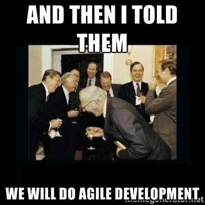
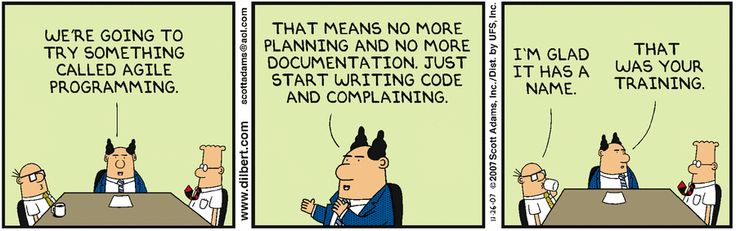
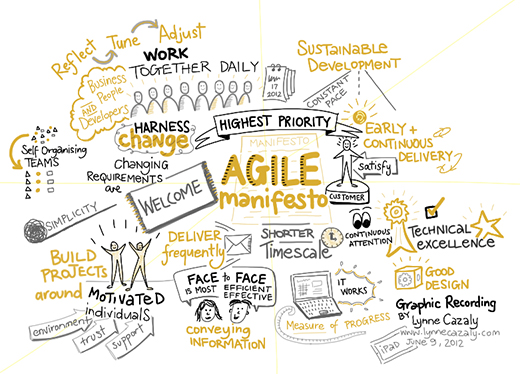
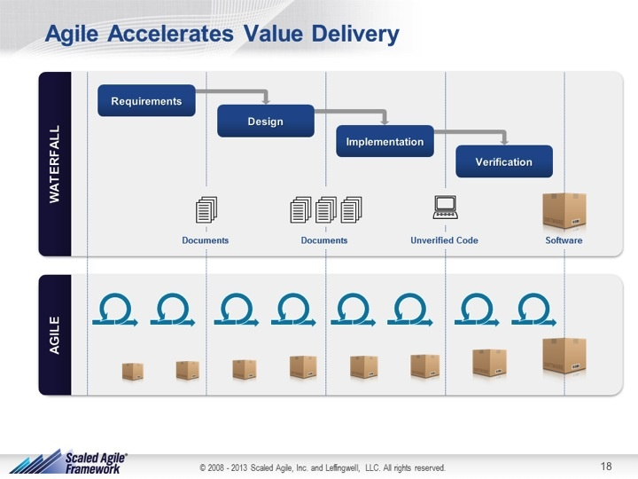
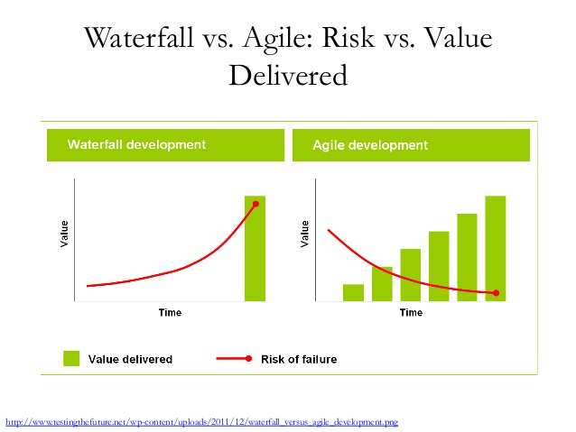
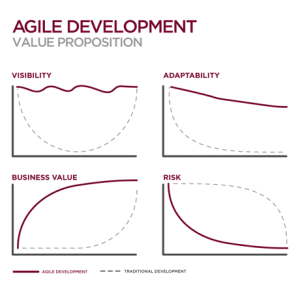
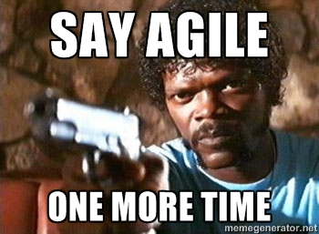

#[fit] The History of Agile
-
-
#A DevOps Tale...

---

—--
#The Challenge

Heavyweight development, "quality", manufacturing methods that critics described as:
- Heavily Regulated
- Regimented
- Micro-managed
- Rigid
- Bureaucratic
- Unexpected Surprises

AKA - Waterfall

---
# Agile Samurai

- You can't gather all the requirements up front
- The requirements you do gather **will** change
- There is always more to do than time and money will allow

-- The Agile Samurai, J. Rasmusson

---
# Other Waterfall Challenges

-18% of software projects are considered "failed"
-43% "challenged"
-39% actually succeeding

-
-
-
-
-

###The Standish Group:(http://www.versionone.com/assets/img/files/CHAOSManifesto2013.pdf)

---
>It is not necessary to change. Survival is not mandatory.
-- W. Edwards Deming

----
> Amazon deploys new software to production every 11.6 seconds.
-- Jon Jenkins, Amazon, Velocity 2011

---
#Agile Movement

-Not a methodology!
-The Agile movement seeks alternatives to traditional project management.
-Agile approaches help teams respond to unpredictability through incremental, iterative work cadences and empirical feedback.
-Agilists propose alternatives to waterfall, or traditional sequential development.

---
#Agile Manifesto - Motivation

We are uncovering better ways of developing software by doing it and helping others do it.

-
-
-
-
-

[Agile Manifesto]: [http://agilemanifesto.org/]

---
#Agile Manifesto - Values

-Individuals and interactions over processes and tools
-Working software over comprehensive documentation
-Customer collaboration over contract negotiation
-Responding to change over following a plan

#That is, while there is value in the items on the right, we value the items on the left more.

---

---
#12 Principles of Agile

-Our highest priority is to __satisfy the customer__ through early and continuous delivery of valuable software.

-__Welcome changing requirements__, even late in development.

-__Deliver working software frequently__, with a preference to the shorter timescale.

---
#12 Principles of Agile

-__Business people and developers__ must work together throughout the project.

-Build projects around __motivated individuals__. Give them the environment and support they need, and trust them to get the job done.

-The most efficient and effective method of conveying information is __face-to-face conversation__.

---
#12 Principles of Agile

-__Working software__ is the primary measure of progress.

-Agile processes promote __sustainable development__. The sponsors, developers, and users should be able to maintain a constant pace indefinitely.

-Continuous attention to __technical excellence and good design__ enhances agility.

---
#12 Principles of Agile

-__Simplicity__ - the art of maximizing the amount of work not done - is essential.

-The best architectures, requirements, and designs emerge from __self-organizing teams__.

-At regular intervals, the team __reflects__ on how to become more effective, then __tunes and adjusts__ its behavior accordingly.

---

---
#Agile - What it looks like

---
#Agile - What it looks like

---
#Agile - What it looks like

---
#Agile - What it looks like

---
#Agile - Culture

---
#Agile - Hours
>I usually get into the office around 9:45. Some people get in much earlier -- 8 or 7:30, but then they leave earlier in the day. Others roll in around 11 or 11:30, but stay late into the night. Your hours are flexible, as long as you're getting your work done.

--Kenny Leftin, Software Engineer @ Google

---
#Agile -  Wardrobe

---
#Agile - The Hoodie

---
#Agile - The Hoodie - The Real Reason

---

